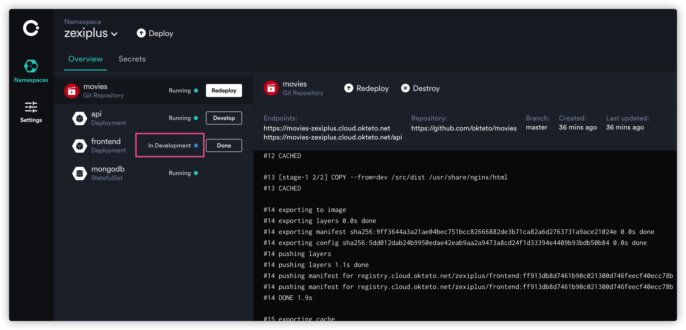
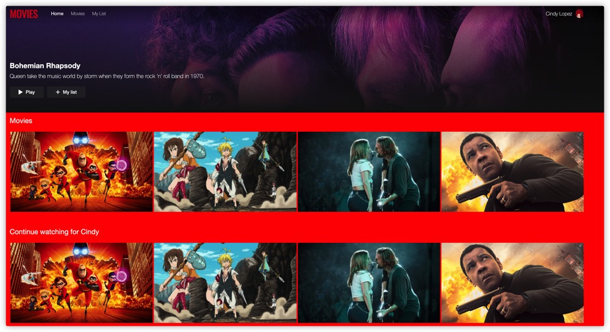

okteto， 一个在 kubernetes 环境中开发调试的工具


## 前提条件

* 已拥有 github 账号
* 已拥有 okteto 账号，若无可[注册](https://cloud.okteto.com/#/login)
* 已安装 kubenetes 


## 安装

**macOs / linux 安装**

```shell
curl https://get.okteto.com -sSfL | sh
// 或者
brew install okteto
```

**windows 安装**

```powershell
scoop install okteto
```


## 克隆项目

浏览器打开：https://github.com/okteto/movies，并 fork 至自己的仓库


## 登陆 okteto cloud

浏览器打开：https://cloud.okteto.com/#/login， 并登陆 okteto cloud， 点击 deploy


## 部署服务

复制之前 fork 的代码仓库地址(例如: https://github.com/zexiplus/movies)并填入, 点击 Deploy 按钮， 等待部署完成。


## 访问服务

当看到三个服务 api， frontend， mongodb 均属于 running 状态， 部署已经完成。点击红色框选的链接 (https://movies-zexiplus.cloud.okteto.net/) , 即可访问 movies 站点 web 服务。


访问站点预览：


## 设置凭据

在开始本地调试前， 你需要设置凭据

下载 okteto cloud kubernetes 集群凭据至本地

```shell
okteto namespace
```

按照指引会在 `$HOME/.kube` 文件夹下生成 kubernetes 凭据。

```shell
Authentication required. Do you want to log into Okteto? [y/n]: y
What is the URL of your Okteto instance? [https://cloud.okteto.com]:
Authentication will continue in your default browser
✓  Logged in as zexiplus
✓  Updated context 'cloud_okteto_com' in '/Users/float/.kube/config'
```

切换 kubernetes 的 context 至 okteto cloud 集群

```shell
# 查看集群 context 信息
kubectl config get-contexts

# 返回结果 =>>
CURRENT   NAME                                           CLUSTER                                        AUTHINFO                                       NAMESPACE
*         cloud_okteto_com                               cloud_okteto_com                               b33c626d-f133-4a0a-bc32-8eaea7624456           zexiplus
          docker-desktop                                 docker-desktop                                 docker-desktop                                 
          docker-for-desktop                             docker-desktop                                 docker-desktop                                 
          gke_my-project-282358_asia-east1-a_cluster-1   gke_my-project-282358_asia-east1-a_cluster-1   gke_my-project-282358_asia-east1-a_cluster-1   
          minikube                                       minikube                                       minikube                                       spinnaker

# 切换当前集群 context 至 okteto cloud
kubectl config use-context cloud_okteto_com
```


## 本地调试

克隆代码至本地：`git clone git@github.com:zexiplus/movies.git`， 使用代码编辑器打开。

进入 `frontend` 目录并启动 okteto 

```shell
cd frontend
okteto up
```

等待启动完成， 返回 okteto cloud 界面观察 frontend 服务进入 in development 状态



编辑 `movies/frontend/src/App.scss` 背景颜色为红色并保存


等待构建完成，返回浏览器 https://movies-zexiplus.cloud.okteto.net/ 页面 , 发现页面背景色已改变为红色。




## 总结

至此， 使用 okteto 部署并调试官方示例 movies 应用已完成。